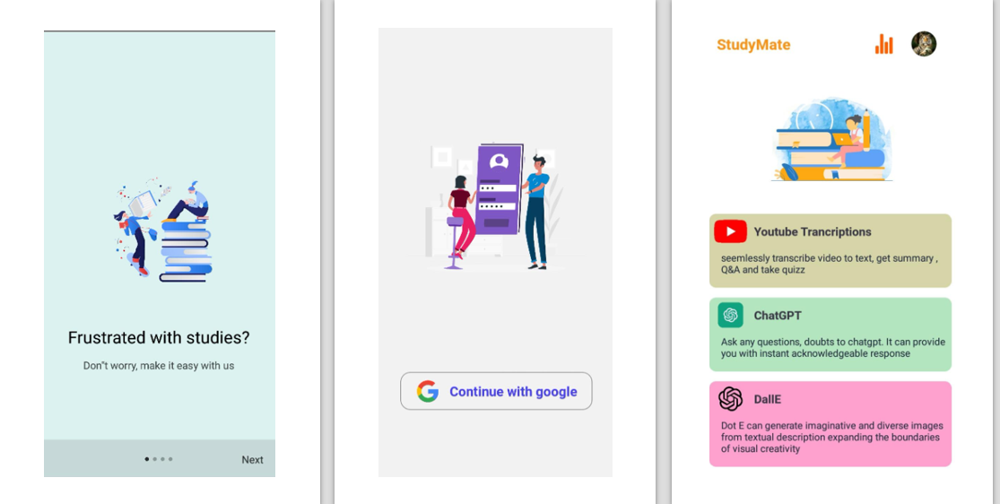
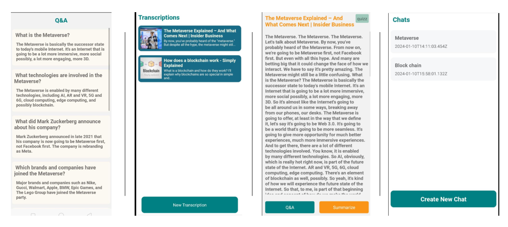

# Study Mate Application
## Overview:
StudyMate is a React Native application designed to enhance student learning and exploration. The app integrates with ChatGPT and DALL·E, enabling students to ask questions, generate and download images, and access a range of learning tools.

## Key Features:

* AI Integration: Students can interact with ChatGPT for doubt clarification and use DALL·E to create and download images.
* YouTube Video Transcription: The app transcribes YouTube videos and provides summaries, Q&A, and quizzes based on the video content.
* Quick Learning: Students can paste a YouTube link to receive a transcription, summary, Q&A, and quizzes, helping them grasp concepts quickly without watching the entire video.
* Quizzes and Leaderboards: Students can take quizzes based on video transcriptions, with scores added to a leaderboard to encourage competitive learning and engagement.

## Technologies Used:

- React Native
- OpenAI (ChatGPT and DALL·E)
- Google OAuth
- Firebase

# Preview

